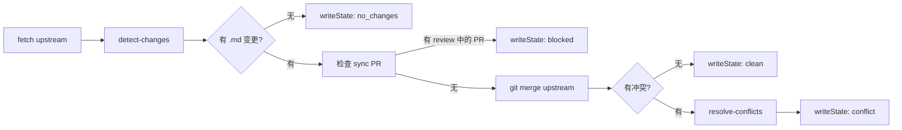

# Vue.js 中文文档自动同步 PR 工作流

本文档介绍 `vuejs-translations/docs-zh-cn` 仓库的自动化同步流程，包括上游同步、冲突检测、AI 翻译、PR 创建和 Review 请求。

## 架构总览

同步流程由两个 GitHub Actions workflow 协作完成：

| Workflow | 职责 | 触发方式 |
|----------|------|----------|
| `autosync.yml` | 每日镜像上游分支 | `schedule`（每日 00:00 UTC） |
| `autopr.yml` | 检测变更、合并、翻译、提 PR | `schedule`（只读检测） / `workflow_dispatch`（全流程） |

### 分支说明

| 分支 | 用途 |
|------|------|
| `main` | 主分支，用于发布和日常开发 |
| `upstream` | 上游 `vuejs/docs:main` 的镜像，每日由 `autosync.yml` 自动同步 |
| `sync` | 翻译工作分支，合并上游变更后翻译，最终通过 PR 合并到 `main` |

### 完整数据流

```
vuejs/docs:main
      │ autosync.yml（每日）
      ▼
upstream 分支（镜像）
      │ autopr.yml detect-changes（每周一，只读）
      ▼
    检测变更（对比 upstream vs sync）
      │
      ├─ 无变更 → 结束
      │
      └─ 有变更 → 判断是否有 review 中的 sync PR
            │
            ├─ 有 → 跳过（避免重复提交）
            │
            └─ 无 → 执行三阶段流水线
                   │
             ┌─────┴──────┐
             │ stage.js   │ 状态持久化: autopr-state.json
             │ prepare    │ 中间产物: todo-translation.json
             ├────────────┤
             │ stage.js   │ AI 翻译产出: done-translation.json
             │ translate  │
             ├────────────┤
             │ stage.js   │ 输出: sync PR
             │ submit     │
             └────────────┘
```

---

## 目录结构

```
.github/scripts/auto-pr/
├── README.md                      # 本文档
├── assets/                        # 文档图片
│   ├── compare-sync-arch.svg
│   └── sync-workflow.svg
├── bin/                           # 可执行入口
│   ├── stage.js                   # 三阶段编排（prepare / translate / submit）
│   └── local-test.js              # 本地测试入口（包装 stage.js，注入 LOCAL=true）
├── prompts/
│   └── translation.md             # AI 翻译 Prompt 模板
└── src/                           # 可复用实现模块
    ├── helpers.js                 # 状态读写（autopr-state.json）、GitHub Output、JSON 工具函数
    ├── detect-changes.js          # 只读检测 upstream vs sync 的 md 变更
    ├── resolve-conflicts.js       # Git 冲突解析 + 新文件段落拆分
    ├── translator.js              # AI 翻译编排（批处理、多 Provider、JSON 修复）
    ├── apply-translations.js      # 将翻译结果写回源文件
    ├── collect-merge-info.js      # 收集最终变更信息
    └── create-pr-and-review.js    # 创建 PR + 请求 Review + 评论
```

### 状态文件 (自动生成，不提交)

| 文件 | 负责写入 | 用途 |
|------|---------|------|
| `autopr-state.json` | `stage.js` 各阶段 | 跨阶段状态传递（merge_result, has_changes, translation_status 等） |
| `todo-translation.json` | `resolve-conflicts.js` | 待翻译的冲突块列表 |
| `done-translation.json` | `translator.js` | AI 翻译完成的结果 |

---

## `autopr.yml` 工作原理

### 触发方式

1. **`schedule` (每周一 03:17 UTC)**：仅运行 `detect-changes.js`，只读检测上游变更，不做任何写操作
2. **`workflow_dispatch` (手动触发)**：执行完整三阶段流水线，可配置 `translate_provider` 和 `skip_translate_gate`

### 环境准备 (所有触发方式共享)

```yaml
- checkout sync 分支（fetch-depth: 0）
- 安装 bun、pnpm、node 20
- pnpm install
```

`schedule` 触发时跳过 AI CLI 安装；`workflow_dispatch` 根据 `TRANSLATE_PROVIDER` 安装对应 CLI。

### 三阶段流水线

各阶段通过 `autopr-state.json` 传递状态，后续阶段读取该文件决定是否执行以及如何执行。

#### Stage 1：`prepare` — 准备

入口：`bin/stage.js prepare`



关键步骤：

1. **检测变更**：`detect-changes.js` 通过 `git rev-list --count` 和 `git diff --name-only --diff-filter=ACMR` 对比 `origin/sync..origin/upstream`，列出变更的 `.md` 文件
2. **同步 PR 保护**：`checkExistingSyncPr()` 调用 `gh pr list --label "从英文版同步" --state open`，若存在 review 中的 sync PR 则写入 `blocked` 状态并跳过
3. **合并上游**：`git merge origin/upstream --no-edit`
4. **冲突解析** (`resolve-conflicts.js`)：

- 按文件类型采用不同策略：
  - `pnpm-lock.yaml` → 整文件接受 theirs (`git checkout --theirs`)
  - `package.json`、`*.vue`、`*.ts`、`*.json` → 解析冲突标记，冲突块取 theirs，保留非冲突区域
  - `*.md` → 逐块解析冲突标记，ours/theirs 写入 `todo-translation.json`
- 检测上游新增文件 (`git diff --diff-filter=A`)，按段落拆分后加入翻译队列

#### Stage 2：`translate` — AI 翻译

入口：`bin/stage.js translate`

1. 读取 `autopr-state.json`，若被 `blocked` 或 `no_changes` 则跳过
2. 读取 `todo-translation.json`
3. 过滤 identical 条目 (`incoming === current`，跳过翻译)
4. 批量调 AI (每批 20 条，并行执行)：
   - **copilot** (CI 默认)：`copilot -p "<prompt>" --allow-all -s`
   - **claude** (本地默认)：通过 stdin 管道传入 prompt，避免 Windows 命令行长度限制
5. 输出 `done-translation.json`，调用 `apply-translations.js` 写回源文件

翻译鲁棒性 (`translator.js`)：

- JSON 解析三层修复：标准解析 → 清理控制字符 → 修复 CJK 引号 (`sanitizeAndParse`)
- 代码块包裹提取 (```json ...```)
- AI 批次失败降级：失败批次使用 `incoming` 作为 `review`
- 长度不匹配自动修正

#### Stage 3：`submit` — 提交并创建 PR

入口：`bin/stage.js submit`

1. 收集最终合并信息 (`collect-merge-info.js`)：
   - 从 `todo-translation.json` 提取冲突文件列表
   - `git diff HEAD -- src/**/*.md` 获取实际变更文件
2. `git add -A` → `git commit` → `git push origin sync --force-with-lease`
3. 创建 PR (`create-pr-and-review.js`)：
   - 检查是否已有 `sync → main` 的 open PR，有则复用
   - PR 标题：`Sync(autopr) #<hash> — upstream merge & translate`
   - PR 正文：upstream hash、merge result、upstream diff 链接、冲突/变更文件列表
   - Labels：`从英文版同步`、`请使用 merge commit 合并`
4. 请求 Review：
   - API 请求 `copilot-pull-request-reviewer[bot]` review
   - 发表评论 @veaba 要求检查：翻译准确性、无意外变更、markdown 完整性

---

## 状态管理

所有跨阶段状态通过 `autopr-state.json` 传递，由 `helpers.js` 的 `readState` / `writeState` 管理：

```typescript
interface AutoprState {
  // 上游信息
  upstream_repo: string;          // "vuejs/docs"
  upstream_branch: string;        // "upstream"
  sync_branch: string;            // "sync"
  target_branch: string;          // "main"
  sync_base_hash: string;         // merge-base 的短 hash
  upstream_hash: string;          // 上游最新 commit hash
  upstream_behind_count: number;  // sync 落后 upstream 的 commit 数

  // 检测结果
  detect_changed_files: string;   // 逗号分隔的变更 md 文件列表
  merge_result: "no_changes" | "clean" | "conflict" | "blocked_by_existing_pr";
  merge_status: "skipped" | "clean" | "conflict" | "blocked";
  has_changes: boolean;

  // 翻译结果
  translation_status?: "skipped" | "success" | "partial_failure" | "failed";
  translation_provider?: string;
  translations_applied?: boolean;

  // 同步 PR 保护
  existing_sync_pr_count?: number;

  // 最终合并信息
  conflict_files?: string;
  changed_files?: string;
}
```

---

## Secrets 配置

| Secret | 用途 |
|--------|------|
| `GITHUB_TOKEN` | Classic PAT，用于 checkout、push、创建 PR/Issue、请求 review |
| `COPILOT_TOKEN` | Fine-Grained PAT，Copilot CLI 认证（需 "Copilot for PRs" 权限） |

---

## 安全保护机制

### 翻译失败 Gate

- 默认翻译失败会阻断 `submit` 阶段
- 手动触发时可通过 `skip_translate_gate: true` 跳过 (用于测试或降级)

### 同步 PR 重复提交保护

- `prepare` 阶段自动检查是否存在带有 `从英文版同步` label 的 open PR
- 存在则写入 `merge_status: "blocked"`，translate / submit 阶段读取后跳过
- 仅作用于 `workflow_dispatch` 手动触发路径

### 并发控制

- Workflow 级别 `concurrency: autopr-sync` 确保任何时间只有一个运行实例
- `cancel-in-progress: false` 防止正在进行的流程被新触发中断

---

## 本地测试指南

在本地分步测试 Auto-PR 工作流，避免每次都要推送到 GitHub Actions。

### 前置条件

| 条件 | 说明 |
|------|------|
| Node.js >= 18 | 运行 JS 脚本 |
| pnpm | 安装仓库依赖 |
| git 分支状态 | 建议在临时 worktree 中从 `origin/sync` 开始测试 |
| Claude CLI | 本地默认翻译 provider（翻译阶段需要） |
| GH Token | 仅在需要实际创建 PR 时配置；本地默认 dry-run |

### 快速开始

```bash
pnpm install

# 推荐：在临时 worktree 中测试
git fetch origin upstream sync
git worktree add -b autopr-local-test ../vue-docs-autopr-test origin/sync
cd ../vue-docs-autopr-test
pnpm install

# 运行完整三阶段流程
pnpm exec node .github/scripts/auto-pr/bin/local-test.js --stage all
```

### 分阶段执行

```bash
# Stage 1: 检测变更 + merge + 冲突解析
pnpm exec node .github/scripts/auto-pr/bin/local-test.js --stage prepare

# Stage 2: AI 翻译（默认 claude）
pnpm exec node .github/scripts/auto-pr/bin/local-test.js --stage translate
pnpm exec node .github/scripts/auto-pr/bin/local-test.js --stage translate --provider copilot

# Stage 3: 收集信息 + 预览 PR（本地不会 commit/push）
pnpm exec node .github/scripts/auto-pr/bin/local-test.js --stage submit
```

本地模式下：

- `LOCAL=true` 自动设置
- 跳过 `git config user`、`git commit`、`git push`
- PR 创建阶段仅预览 title/body，不调用 GitHub API

### 高效迭代

```bash
pnpm exec node .github/scripts/auto-pr/bin/local-test.js --stage prepare
# 手动修改翻译
pnpm exec node .github/scripts/auto-pr/bin/local-test.js --stage translate
git diff -- src/**/*.md        # 检查翻译结果
pnpm exec node .github/scripts/auto-pr/bin/local-test.js --stage submit   # 预览 PR
```

---

## 翻译约定

翻译 Prompt 模板 `prompts/translation.md` 是核心，包含：

- **决策流程**：跳过判断 → 插入/替换策略
- **翻译原则**：最小改动、术语准确、风格一致
- **不需翻译的内容**：代码块、行内代码、URL、标识符、frontmatter
- **10 种典型示例**：覆盖局部替换、插入新内容、含锚点标题、含 URL 段落等场景

模板中的 `{{TERMINOLOGY}}`、`{{FORMATTING}}`、`{{GUIDELINES}}`、`{{ITEMS}}` 占位符由 `translator.js` 运行时替换为实际的翻译规范文件。

参考文件：

- [主约定](../../../.claude/skills/vuejs-docs-zh-cn/SKILL.md)
- [术语翻译约定](../../../.claude/skills/vuejs-docs-zh-cn/references/terminology.md)
- [文本格式](../../../.claude/skills/vuejs-docs-zh-cn/references/formatting.md)
- [翻译指南](../../../.claude/skills/vuejs-docs-zh-cn/references/guidelines.md)

---

## 常见问题排查

| 问题 | 原因 | 解决 |
|------|------|------|
| `detect-changes.js` 报 git 错误 | 缺少远程分支引用 | 执行 `git fetch origin upstream sync` |
| `todo-translation.json` 为空数组 | 没有冲突块需要翻译 | 检查 `git merge` 是否真的产生了冲突 |
| Claude CLI 翻译失败 | 输出不是合法 JSON | 检查翻译 prompt，确保返回正确格式的 JSON 数组 |
| `done-translation.json` 缺少 `review` 字段 | AI 输出格式不匹配 | 检查翻译 prompt，确保返回正确格式的 JSON 数组 |
| `apply-translations.js` 替换后文件错乱 | 行号索引偏移 | 检查 `conflicts` 是否按行号倒序排列 |

---

## 特别感谢

在 `vuejs-translations/docs-zh-cn` 项目中，Github Copilot 额度由 [@Justineo](https://github.com/Justineo) 友情赞助。
