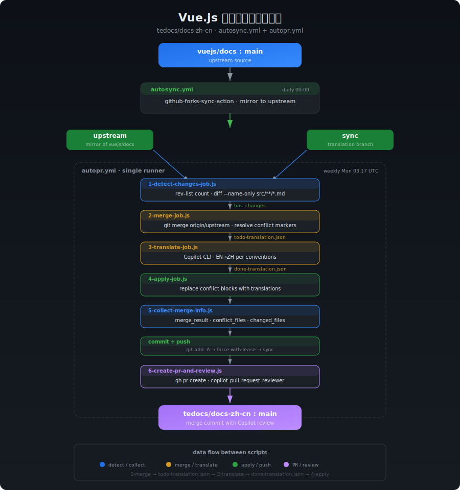
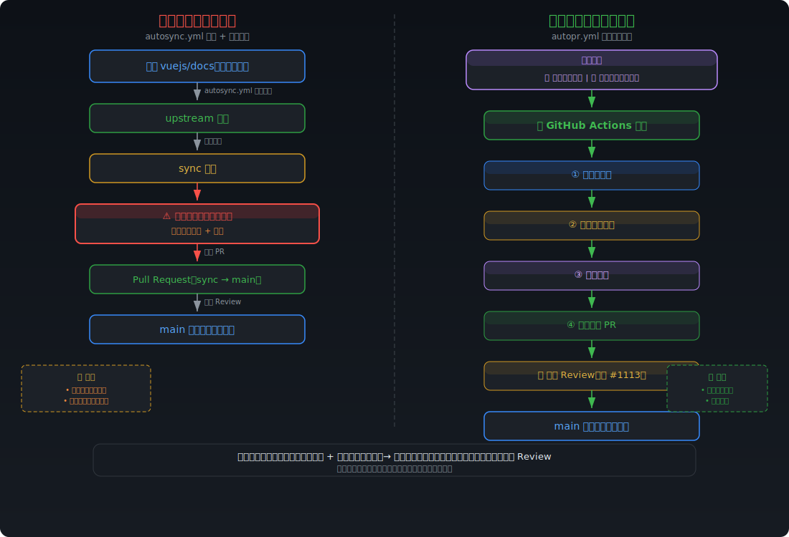

# Vue.js 中文文档自动同步 PR 工作流

本文档介绍 `vuejs-translations/docs-zh-cn` 仓库的自动化同步流程，包括上游同步、冲突检测、Copilot CLI 翻译、PR 和 Review。

## 流程总览



## 本流程是做什么的？

当前同步上游仓库 `vuejs/docs`，是基于自动 `autosync.yml` 的 workflow 同步英文仓库到 `upstream` 分支，然后将 `upstream` 合并到 `sync` 分支，在 `sync` 分支解决合并的冲突、翻译后，将 `sync` 分支通过 PR 合并到 `main` 分支。

此时，社区可以在 PR 中 review，比如：[Sync #31b4521a](https://github.com/vuejs-translations/docs-zh-cn/pull/1113)，在将 `upstream` 合并到 `sync` 分支和冲突过程，往往需要维护者耗费大量的时间精力成本在本地分支解决。

为此，`autopr.yml` 提出的方案是，基于 Github Actions 自动来处理这个过程，并实现：分支预处理——>解决冲突——>翻译——>发起 PR，可以设置为每周执行一次，或者维护者手动在 Github Actions 手动触发 `autopr.yml`，仅需点一下，自动完成整个流程。



### 分支说明

| 分支       | 用途                                                    |
|------------|---------------------------------------------------------|
| `main`     | 主分支，用于发布和日常开发                               |
| `upstream` | 上游 `vuejs/docs:main` 的镜像，每日自动同步              |
| `sync`     | 翻译工作分支，合并上游变更后翻译，最终通过 PR 合并到 main |

## `autopr.yml` 如何工作？

### 第一步 (已有)：自动同步上游 (autosync.yml)

**触发方式**： 每日 00:00 自动执行 / 手动触发

**流程：**

1. 使用 `github-forks-sync-action` 拉取 `vuejs/docs:main` 的最新内容
2. 推送到 `vuejs-translations/docs-zh-cn:upstream` 分支
3. 纯镜像同步，不做任何翻译

```
vuejs/docs:main ──autosync.yml──→ vuejs-translations:upstream
```

### 第二步 (新增)：检测、合并、翻译、提交、发 PR (autopr.yml)

**触发方式**：每周一 03:17 UTC 自动执行 / [手动触发](/actions)

单 runner 串行执行 6 个 JS 脚本：

```
┌─────────────────────────────┐
│ 1-detect-changes-job.js     │
└──────────┬──────────────────┘
           │
     ┌─────┴─────┐
     │ has_changes│
     │  no_changes│──→ 结束
     └─────┬─────┘
           ▼
┌─────────────────────────────┐
│ 2-merge-job.js              │
└──────────┬──────────────────┘
           ▼
┌─────────────────────────────┐
│ 3-translate-job.js          │←── translation-prompt.md
└──────────┬──────────────────┘
           ▼
┌─────────────────────────────┐
│ 4-apply-job.js              │
└──────────┬──────────────────┘
           ▼
┌─────────────────────────────┐
│ 5-collect-merge-info.js     │
└──────────┬──────────────────┘
           ▼
┌─────────────────────────────┐
│ commit + push               │
└──────────┬──────────────────┘
           ▼
┌─────────────────────────────┐
│ 6-create-pr-and-review.js   │
└─────────────────────────────┘
```

#### `1-detect-changes-job.js` — 前置过滤

- `git rev-list --count origin/sync..origin/upstream` 判断有无新提交
- `git diff --name-only` 检出变更的 `.md` 文件列表
- 输出 `upstream_hash`、`changed_files`
- 无变更时输出 `merge_result=no_changes`，整个流程终止

#### `2-merge-job.js` — 冲突解决

- `git merge origin/upstream` 触发合并
- 解析冲突标记，按策略处理：
  - `pnpm-lock.yaml` → 整文件接受 incoming
  - `package.json`、`*.vue`、`*.ts`、`*.json` → 解析标记，只替换冲突块
  - `.md` 文件 → 逐块解析，记录 ours/theirs 到 `todo-translation.json`
- 解决后 `git add` 暂存

#### `3-translate-job.js` — Copilot CLI 翻译

- 读取 `todo-translation.json`
- 加载 `translation-prompt.md` 模板，注入翻译约定 (terminology.md、formatting.md、guidelines.md)，详见 `vuejs-docs-zh-cn` skill。
- 过滤 identical 条目 (`incoming === current`)，仅翻译有差异的条目
- 根据 `TRANSLATE_MODE` 环境变量选择模式 (默认 `all`)，调用 `copilot -p "..." --allow-all -s` 翻译 EN→ZH
- 输出 `done-translation.json`
- 翻译失败时设置 `translate_status=failed`，由下游 gate 拦截

#### `4-apply-job.js` — 应用翻译

- 读取 `done-translation.json`
- 按文件分组，按行号倒序替换，避免索引偏移

#### `5`-collect-merge-info.js` — 收集真实结果

- 读取 `todo-translation.json` 提取实际冲突文件列表
- `git diff HEAD` 收集实际变更文件
- 输出 `merge_result` (conflict/clean)、`conflict_files`、`changed_files`

#### `6-create-pr-and-review.js` — 发起 PR + Review

- `gh pr list` 检查是否已有 open PR (有则复用，避免重复创建)
- `gh pr create` 创建 PR：
  - title: `Sync(autopr) #<hash> — upstream merge & translate`
  - body：包含 upstream hash、merge result、upstream diff 链接、冲突文件列表、翻译文件列表
  - labels：`从英文版同步`、`请使用 merge commit 合并`
- GitHub API 请求 `copilot-pull-request-reviewer[bot]` review
- 发表评论要求检查：翻译准确性、无意外变更、markdown 格式完整性、代码块和链接完整性

## Secrets 配置

| Secret 名称            | 用途                                                          |
|------------------------|---------------------------------------------------------------|
| `GITHUB_TOKEN`    | Classic PAT，用于 checkout、push、创建 PR/Issue、请求 review      |
| `COPILOT_TOKEN` | Fine-Grained PAT，Copilot CLI 认证（需 "Copilot Requests" 权限） |

## 翻译约定

- [主约定](../../../.claude/skills/vuejs-docs-zh-cn/SKILL.md)
- [术语翻译约定](../../../.claude/skills/vuejs-docs-zh-cn/references/terminology.md)
- [文本格式](../../../.claude/skills/vuejs-docs-zh-cn/references/formatting.md)
- [翻译指南](../../../.claude/skills/vuejs-docs-zh-cn/references/guidelines.md)

## 特殊说明

### 翻译模式

通过环境变量 `TRANSLATE_MODE` 控制，默认 `all`。

| 模式   | 行为                                      | 适用场景                   |
|--------|-------------------------------------------|--------------------------|
| `all`  | 一次 Copilot CLI 调用翻译所有条目           | 条目少（<50），追求效率     |
| `file` | 按文件分组，每个文件一次调用                 | 条目较多，按文件粒度控制    |
| `item` | 每个条目单独一次调用                        | 大量变更，需要精确控制质量   |

[3-translate-job.js](3-translate-job.js) 会自动过滤 identical 条目 (`incoming === current`)，仅翻译有实际差异的条目，减少不必要的 Copilot CLI 调用。

如果出现大量变更导致 `todo-translation.json` 过大、Copilot CLI 处理失败，可切换到 `file` 或 `item` 模式解决。

### translation-prompt.md

[translation-prompt.md](translation-prompt.md) 是翻译的核心 prompt 模板，包含：

- 决策流程 (跳过判断 → 插入/替换策略)
- 翻译原则 (最小改动、术语准确、风格一致)
- 不需翻译的内容 (代码块、行内代码、URL、标识符等)
- 完整示例 (10 种典型场景)

模板中的 `{{TERMINOLOGY}}`、`{{FORMATTING}}`、`{{GUIDELINES}}`、`{{ITEMS}}` 占位符由 3-translate-job.js 运行时替换。

### 翻译失败 Gate

工作流内置了翻译失败保护机制：

- [3-translate-job.js](3-translate-job.js) 设置 `continue-on-error: true`，翻译失败不会立即终止 workflow
- 下游 `Check translation status` 步骤检查翻译结果，失败时阻断 PR 创建
- 手动触发时可通过 `skip_translate_gate: true` 跳过此检查 (用于测试)

### sync 分支仍需手动处理

- [ ] 后续考虑采用 ci 的方式来完成，预计 `sync->main` 仍需人为处理

### 保留手动 sync 的方式

为了避免预期之外的因素导致 `autopr.yml` 的方式失败，目前仍保留手动合并同步的方式，请参考 `pnpm run sync`。

## 本地测试指南

在本地分步测试 Auto-PR 工作流，避免每次都要推送到 GitHub Actions 才能验证。

### 前置条件

| 条件 | 说明 |
|------|------|
| Node.js >= 18 | 运行 JS 脚本 |
| git 分支状态 | 不同步骤需要不同分支状态（见各步骤说明） |
| Claude CLI (步骤 3) | 安装: `npm install -g @anthropic-ai/claude-code` |
| GH Token (步骤 6 正式版) | 仅在需要实际创建 PR 时配置 |

### 快速开始

```bash
# 安装依赖（1-detect-changes-job.js 需要 simple-git）
cd <项目根目录>
npm install simple-git

# 推荐：使用编排器（会自动设置 LOCAL=true，跨平台兼容）
node .github/scripts/auto-pr/local-test.js --step all
node .github/scripts/auto-pr/local-test.js --step 1
node .github/scripts/auto-pr/local-test.js --step 1,2,3
node .github/scripts/auto-pr/local-test.js --step 3 --mode file
```

### 分步执行说明

#### 步骤 1：检测变更

```bash
node .github/scripts/auto-pr/local-test.js --step 1
```

**前提**：本地仓库需要包含 `origin/upstream` 和 `origin/sync` 分支引用。

```bash
# 获取上游分支信息
git fetch origin upstream sync
```

**验证**：观察输出的 `upstream_hash` 和 `changed_files`。如果显示 `no_changes`，说明 sync 分支已是最新。

#### 步骤 2：合并冲突解析

```bash
node .github/scripts/auto-pr/local-test.js --step 2
```

**前提**：

- 当前处于 `sync` 分支：`git checkout sync`
- git status 干净：`git status` 不应有未提交的更改
- 包含 `origin/upstream` 的远程引用

**验证**：检查生成的 `.github/scripts/auto-pr/todo-translation.json`：

```bash
# 查看待翻译条目概览
cat .github/scripts/auto-pr/todo-translation.json | node -e "const d=require('fs').readFileSync('/dev/stdin','utf-8');const j=JSON.parse(d);console.log('条目数:',j.length);console.log('文件:',[...new Set(j.map(i=>i.file))])"

# 查看第一个条目的结构（含 file, lines, ours, theirs 字段）
node -e "const j=require('./.github/scripts/auto-pr/todo-translation.json');console.log(JSON.stringify(j[0],null,2))"
```

#### 步骤 3：本地翻译

```bash
# 模式 all - 一次调用翻译所有条目（默认）
node .github/scripts/auto-pr/local-test.js --step 3 --mode all

# 模式 file - 按文件分组翻译
node .github/scripts/auto-pr/local-test.js --step 3 --mode file

# 模式 item - 逐条翻译（最稳定，适合大量变更）
node .github/scripts/auto-pr/local-test.js --step 3 --mode item
```

**前提**：

- `.github/scripts/auto-pr/todo-translation.json` 已存在 (步骤 2 生成)
- Claude CLI 已安装

**验证**：检查生成的 `.github/scripts/auto-pr/done-translation.json`：

```bash
# 检查翻译结果概览
node -e "const j=require('./.github/scripts/auto-pr/done-translation.json');console.log('条目数:',j.length);console.log('含 review:',j.every(i=>i.review!==undefined));console.log('示例:',JSON.stringify(j[0],null,2))"

# 目视检查 review 字段是否为中文
node -e "const j=require('./.github/scripts/auto-pr/done-translation.json');j.forEach(i=>console.log(i.file,i.lines,'→',i.review.slice(0,80)))"
```

#### 步骤 4：应用翻译

```bash
node .github/scripts/auto-pr/local-test.js --step 4
```

**前提**：`.github/scripts/auto-pr/done-translation.json` 已存在。

**验证**：

```bash
# 查看源文件的变更
git diff -- src/**/*.md

# 确认冲突标记已被替换
git diff --name-only -- src/**/*.md
```

#### 步骤 5：收集合并信息

```bash
node .github/scripts/auto-pr/local-test.js --step 5
```

**验证**：观察输出的 `merge_result`、`conflict_files`、`changed_files`。

#### 步骤 6：PR 内容预览（本地 dry-run）

```bash
node .github/scripts/auto-pr/local-test.js --step 6
```

此步骤在本地生成 PR 的 title 和 body 预览，不会实际调用 GitHub API。

如需正式创建 PR，请运行：

```bash
# 需配置 GH_TOKEN 环境变量
GH_TOKEN=ghp_xxx node .github/scripts/auto-pr/6-create-pr-and-review.js
```

### 高效迭代工作流

```bash
# 1. 先切换到 sync 分支并获取最新上游
git checkout sync
git fetch origin upstream

# 2. 快速迭代：重复步骤 2→3→4 直至满意
node .github/scripts/auto-pr/local-test.js --step 2
node .github/scripts/auto-pr/local-test.js --step 3 --mode file
node .github/scripts/auto-pr/local-test.js --step 4

# 3. 检查差异
git diff -- src/**/*.md

# 4. 回滚重试（如果翻译不满意）
git checkout -- src/**/*.md
# 重新运行步骤 2→3→4
```

### 常见问题排查

| 问题 | 原因 | 解决 |
|------|------|------|
| `1-detect-changes-job.js` 报 git 错误 | 缺少远程分支引用 | 执行 `git fetch origin upstream sync` |
| `todo-translation.json` 为空数组 | 没有冲突块需要翻译 | 检查 `git merge` 是否真的产生了冲突 |
| Claude CLI 翻译失败 | 输出不是合法 JSON | 尝试 `--mode item` 逐条翻译 |
| `done-translation.json` 缺少 `review` 字段 | Claude 输出格式不匹配 | 检查翻译 prompt，确保 Claude 返回正确格式的 JSON 数组 |
| `4-apply-job.js` 替换后文件错乱 | 行号索引偏移 | 检查 `conflicts` 是否按行号倒序排列 |

## 特别感谢

在 `vuejs-translations/docs-zh-cn` 项目中，Github Copilot 额度由 [@Justineo](https://github.com/Justineo) 友情赞助。
