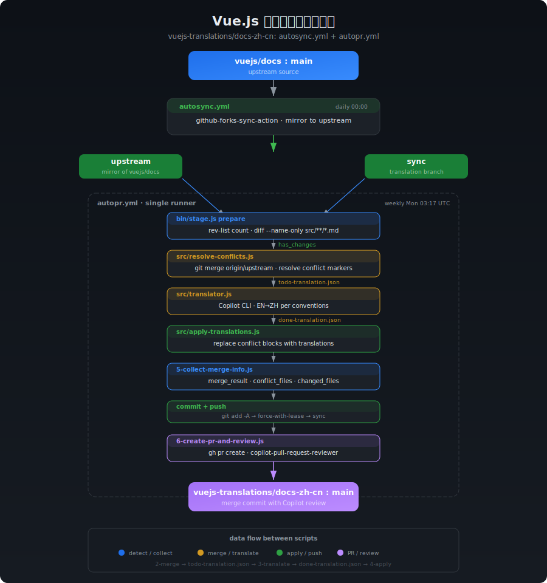

# Vue.js 中文文档自动同步 PR 工作流

本文档介绍 `vuejs-translations/docs-zh-cn` 仓库的自动化同步流程，包括上游同步、冲突检测、Copilot CLI 翻译、PR 和 Review。

## 流程总览



## 本流程是做什么的？

当前同步上游仓库 `vuejs/docs`，是基于自动 `autosync.yml` 的 workflow 同步英文仓库到 `upstream` 分支，然后将 `upstream` 合并到 `sync` 分支，在 `sync` 分支解决合并的冲突、翻译后，将 `sync` 分支通过 PR 合并到 `main` 分支。

此时，社区可以在 PR 中 review，比如：[Sync #31b4521a](https://github.com/vuejs-translations/docs-zh-cn/pull/1113)，在将 `upstream` 合并到 `sync` 分支和冲突过程，往往需要维护者耗费大量的时间精力成本在本地分支解决。

为此，`autopr.yml` 提出的方案是，基于 Github Actions 自动来处理这个过程，并实现：分支预处理——>解决冲突——>翻译——>发起 PR，可以设置为每周执行一次，或者维护者手动在 Github Actions 手动触发 `autopr.yml`，仅需点一下，自动完成整个流程。


### 分支说明

| 分支       | 用途                                                    |
|------------|---------------------------------------------------------|
| `main`     | 主分支，用于发布和日常开发                               |
| `upstream` | 上游 `vuejs/docs:main` 的镜像，每日自动同步              |
| `sync`     | 翻译工作分支，合并上游变更后翻译，最终通过 PR 合并到 main |

### 目录结构

```
.github/scripts/auto-pr/
├── README.md
├── assets/              # 文档图片
├── bin/                 # CI 和本地可执行入口
├── prompts/             # AI 翻译 prompt
└── src/                 # 可复用实现模块
```

## `autopr.yml` 如何工作？

### 第一步 (已有)：自动同步上游 (autosync.yml)

**触发方式**： 每日 00:00 自动执行 / 手动触发

**流程：**

1. 使用 `github-forks-sync-action` 拉取 `vuejs/docs:main` 的最新内容
2. 推送到 `vuejs-translations/docs-zh-cn:upstream` 分支
3. 纯镜像同步，不做任何翻译

```
vuejs/docs:main ──autosync.yml──→ vuejs-translations:upstream
```

### 第二步 (新增)：检测、合并、翻译、提交、发 PR (autopr.yml)

**触发方式**：每周一 03:17 UTC 自动执行 / [手动触发](/actions)

单 runner 串行执行 3 个 stage。`autopr.yml` 只负责环境准备和阶段编排，具体状态传递由
`bin/stage.js` 写入 `.github/scripts/auto-pr/autopr-state.json`：

```
┌─────────────────────────────┐
│ bin/stage.js prepare      │
│ detect + merge + resolve   │
└──────────┬──────────────────┘
           │ no_changes → later stages skip
           ▼
┌─────────────────────────────┐
│ bin/stage.js translate    │
│ AI translate + apply        │
└──────────┬──────────────────┘
           ▼
┌─────────────────────────────┐
│ bin/stage.js submit       │
│ collect + push + PR         │
└─────────────────────────────┘
```

#### Stage 1: `prepare` — AI 翻译前准备

- `git rev-list --count origin/sync..origin/upstream` 判断有无新提交
- `git diff --name-only` 检出变更的 `.md` 文件列表
- `git merge origin/upstream` 触发合并
- 如果有冲突，调用 `src/resolve-conflicts.js` 解析冲突标记：
  - `pnpm-lock.yaml` → 整文件接受 incoming
  - `package.json`、`*.vue`、`*.ts`、`*.json` → 解析标记，只替换冲突块
  - `.md` 文件 → 逐块解析，记录 ours/theirs 到 `todo-translation.json`
- 将 `upstream_hash`、`sync_base_hash`、`merge_status`、`changed_files` 等信息写入 `autopr-state.json`

#### Stage 2: `translate` — AI 翻译并应用结果

- 读取 `todo-translation.json`
- 加载 `prompts/translation.md` 模板，注入翻译约定 (terminology.md、formatting.md、guidelines.md)，详见 `vuejs-docs-zh-cn` skill。
- 过滤 identical 条目 (`incoming === current`)，仅翻译有差异的条目
- 根据 `TRANSLATE_PROVIDER` 选择 AI CLI：
  - `copilot`：CI 默认，调用 `copilot -p "..." --allow-all -s`
  - `claude`：本地默认，调用 `claude -p "..."`
- 输出 `done-translation.json`
- 调用 `src/apply-translations.js` 将翻译结果写回源文件

#### Stage 3: `submit` — 提交 sync 并创建 PR

- 调用 `src/collect-merge-info.js` 收集真实结果
- `git add -A`、commit 并 `git push origin sync --force-with-lease`
- `gh pr list` 检查是否已有 open PR (有则复用，避免重复创建)
- 调用 `src/create-pr-and-review.js` 创建 PR：
  - title: `Sync(autopr) #<hash> — upstream merge & translate`
  - body：包含 upstream hash、merge result、upstream diff 链接、冲突文件列表、翻译文件列表
  - labels：`从英文版同步`、`请使用 merge commit 合并`
- GitHub API 请求 `copilot-pull-request-reviewer[bot]` review
- 发表评论要求检查：翻译准确性、无意外变更、markdown 格式完整性、代码块和链接完整性

## Secrets 配置

| Secret 名称            | 用途                                                          |
|------------------------|---------------------------------------------------------------|
| `GITHUB_TOKEN`    | Classic PAT，用于 checkout、push、创建 PR/Issue、请求 review      |
| `COPILOT_TOKEN` | Fine-Grained PAT，Copilot CLI 认证（需 "Copilot Requests" 权限） |

CI 默认使用 `TRANSLATE_PROVIDER=copilot`。本地测试默认使用 `claude`，如需在 CI 手动切换到
`claude`，需要确保对应 CLI 认证可用。

## 翻译约定

- [主约定](../../../.claude/skills/vuejs-docs-zh-cn/SKILL.md)
- [术语翻译约定](../../../.claude/skills/vuejs-docs-zh-cn/references/terminology.md)
- [文本格式](../../../.claude/skills/vuejs-docs-zh-cn/references/formatting.md)
- [翻译指南](../../../.claude/skills/vuejs-docs-zh-cn/references/guidelines.md)

## 特殊说明

### prompts/translation.md

[prompts/translation.md](prompts/translation.md) 是翻译的核心 prompt 模板，包含：

- 决策流程 (跳过判断 → 插入/替换策略)
- 翻译原则 (最小改动、术语准确、风格一致)
- 不需翻译的内容 (代码块、行内代码、URL、标识符等)
- 完整示例 (10 种典型场景)

模板中的 `{{TERMINOLOGY}}`、`{{FORMATTING}}`、`{{GUIDELINES}}`、`{{ITEMS}}` 占位符由 `src/translator.js` 运行时替换。

### 翻译失败 Gate

工作流内置了翻译失败保护机制：

- [bin/stage.js](bin/stage.js) 的 `translate` stage 负责捕获翻译失败
- 默认情况下翻译失败会阻断后续 `submit` stage
- 手动触发时可通过 `skip_translate_gate: true` 跳过此检查 (用于测试)

### sync 分支仍需手动处理

- [ ] 后续考虑采用 ci 的方式来完成，预计 `sync->main` 仍需人为处理

### 保留手动 sync 的方式

为了避免预期之外的因素导致 `autopr.yml` 的方式失败，目前仍保留手动合并同步的方式，请参考 `pnpm run sync`。

## 本地测试指南

在本地分步测试 Auto-PR 工作流，避免每次都要推送到 GitHub Actions 才能验证。

### 前置条件

| 条件 | 说明 |
|------|------|
| Node.js >= 18 | 运行 JS 脚本 |
| pnpm | 安装仓库依赖 |
| git 分支状态 | 建议在临时 worktree 中从 `origin/sync` 开始测试 |
| Claude CLI | 本地默认翻译 provider，跑 `translate` stage 时需要 |
| GH Token | 仅在需要实际创建 PR 时配置；本地默认 dry-run |

### 快速开始

```bash
cd <项目根目录>
pnpm install

# 推荐：在临时 worktree 中测试，避免污染当前分支
git fetch origin upstream sync
git worktree add -b autopr-local-test ../vue-docs-autopr-test origin/sync
cd ../vue-docs-autopr-test
pnpm install

# 运行完整三阶段流程。LOCAL=true 会跳过 commit/push，并只预览 PR 内容。
pnpm exec node .github/scripts/auto-pr/bin/local-test.js --stage all
```

### 分步执行说明

#### Stage 1：prepare

```bash
pnpm exec node .github/scripts/auto-pr/bin/local-test.js --stage prepare
```

这一阶段会检测 `origin/upstream` 相对 `origin/sync` 的 markdown 变更，执行 merge，并在出现冲突时生成
`.github/scripts/auto-pr/todo-translation.json`。

**前提**：

- 当前测试 worktree 从 `origin/sync` 开始
- `git status` 干净
- 已拉取 `origin/upstream` 和 `origin/sync`

#### Stage 2：translate

```bash
# 默认本地 provider 是 claude
pnpm exec node .github/scripts/auto-pr/bin/local-test.js --stage translate

# 本地也可以显式测试 copilot provider
pnpm exec node .github/scripts/auto-pr/bin/local-test.js --stage translate --provider copilot
```

这一阶段读取 `todo-translation.json`，调用 AI CLI 生成 `done-translation.json`，然后把翻译结果应用回源文件。

#### Stage 3：submit

```bash
pnpm exec node .github/scripts/auto-pr/bin/local-test.js --stage submit
```

本地 `submit` 只收集合并信息并预览 PR title/body，不会 commit、push 或调用 GitHub API。

### 高效迭代工作流

```bash
# 1. 先在临时 worktree 中准备 merge 结果
pnpm exec node .github/scripts/auto-pr/bin/local-test.js --stage prepare

# 2. 快速迭代翻译

# 3. 检查差异
git diff -- src/**/*.md

# 4. 预览 PR 内容
pnpm exec node .github/scripts/auto-pr/bin/local-test.js --stage submit
```

### 常见问题排查

| 问题 | 原因 | 解决 |
|------|------|------|
| `src/detect-changes.js` 报 git 错误 | 缺少远程分支引用 | 执行 `git fetch origin upstream sync` |
| `todo-translation.json` 为空数组 | 没有冲突块需要翻译 | 检查 `git merge` 是否真的产生了冲突 |
| Claude CLI 翻译失败 | 输出不是合法 JSON | 检查翻译 prompt，确保 Claude 返回正确格式的 JSON 数组 |
| `done-translation.json` 缺少 `review` 字段 | Claude 输出格式不匹配 | 检查翻译 prompt，确保 Claude 返回正确格式的 JSON 数组 |
| `src/apply-translations.js` 替换后文件错乱 | 行号索引偏移 | 检查 `conflicts` 是否按行号倒序排列 |

## 特别感谢

在 `vuejs-translations/docs-zh-cn` 项目中，Github Copilot 额度由 [@Justineo](https://github.com/Justineo) 友情赞助。
