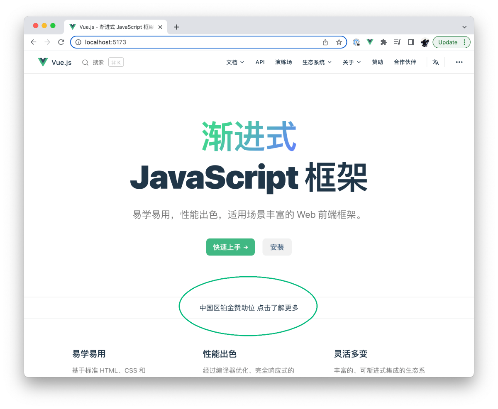
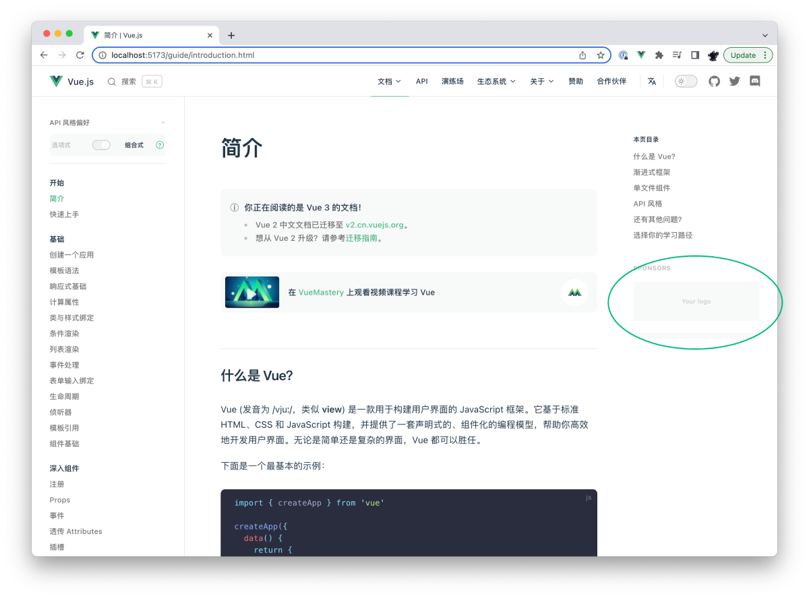

# 成为 Vue.js 的赞助者 {#become-a-vue-js-sponsor}

Vue.js 是采用 MIT 许可的开源项目，使用完全免费。

维护这样一个庞大的生态系统和为项目开发新功能所需的巨大努力，只有在我们的赞助者慷慨的财务支持下才得以持续。

## 中国区赞助渠道

来自国内的开发者或公司可以通过 [爱发电](https://afdian.net/a/evanyou) 平台来支持 Vue.js 的开发。爱发电上的赞助等级和本页下面列出的赞助等级是一一对应的。

其中**中国区铂金赞助商**是仅针对本站 (cn.vuejs.org) 的赞助位级别，包含以下权益：

1. [cn.vuejs.org](/) 首屏无需滚动可见的 logo 展示位：

2. 所有内容页面的侧边栏上的明显的 logo 展示位：

3. 在 [`vuejs/core`](https://github.com/vuejs/core) 和 [`vuejs/vue`](https://github.com/vuejs/core) 的 README 上明显的 logo 展示位。

此赞助位同样可以通过 [爱发电](https://afdian.net/a/evanyou) 来订阅。如果您对此赞助位感兴趣但还抱有疑问，请致信 [sponsor@vuejs.org](mailto:sponsor@vuejs.org) 咨询具体事宜。

## 国际站赞助 {#how-to-sponsor}

如果您想要在国际站放置赞助 logo，则更建议通过 [GitHub Sponsors](https://github.com/sponsors/yyx990803) 或 [OpenCollective](https://opencollective.com/vuejs) 用美元进行赞助。赞助发票可以通过 GitHub 的支付系统获得。我们同时接受每月定期的赞助和一次性的捐赠。定期的赞助有权获得[赞助等级](#tier-benefits)中提供的 logo 展示位。

## 以企业名义赞助 Vue {#sponsoring-vue-as-a-business}

赞助 Vue 可以让你通过我们的网站和 GitHub 项目的 README 在全球超过 **170 万**的 Vue 开发者面前获得巨大曝光。此外，支持开源项目可以提高你的品牌声誉，这对任何与开发者互动的公司来说都是重要的资产。

如果你正在使用 Vue 来构建一款创收的产品，那么赞助 Vue 的开发是很有商业意义的。**它可以确保你的产品所依赖的项目保持在健康和积极的维护状态**。在 Vue 社区的曝光和积极的品牌形象也会使你更容易吸引和招募 Vue 开发者。

如果你正在建立一个面向开发者的产品，你将通过赞助曝光获得高质量的流量，因为我们的访问者都是开发者。这样的赞助还可以建立品牌知名度，提高转化率。

## 以个人名义赞助 Vue {#sponsoring-vue-as-an-individual}

如果你是个人用户，并且享受到了 Vue 带给你的生产力，请考虑捐赠以示感谢——就当是偶尔请我们喝杯咖啡。我们的许多团队成员都通过 GitHub Sponsors 接受赞助和捐赠。在我们的[团队页面](/about/team)上，你可以找到每个团队成员的个人资料，及其“赞助”按钮。

你也可以尝试说服你的雇主以企业的名义赞助 Vue。这可能并不容易，但企业赞助通常会对开放源码软件项目的可持续性产生比个人捐赠大得多的影响，所以如果你能够做到，这对我们的帮助会更大。

## 赞助等级 {#tier-benefits}

**以下赞助等级均仅针对我们面向国际用户的英文版网站 vuejs.org。**

- **全球特别赞助商**：
  - 全球独家赞助商 (目前已经满员)。
  - [vuejs.org](https://vuejs.org) 首屏无需滚动可见的独家 logo 展示位。
  - 所有级别的 logo 展示位中最显眼的位置。
- **铂金赞助商 (2,000 美元/月)**：
  - [vuejs.org](https://vuejs.org) 首页明显的 logo 展示位。
  - 所有内容页面的侧边栏上的明显的 logo 展示位。
  - 在 [`vuejs/core`](https://github.com/vuejs/core) 和 [`vuejs/vue`](https://github.com/vuejs/core) 的 README 上明显的 logo 展示位。
- **金牌赞助商 (500 美元/月)**：
  - [vuejs.org](https://vuejs.org) 首页大号的 logo 展示位。
  - 在 `vuejs/core` 和 `vuejs/vue` 的 README 上大号的 logo 展示位。
- **银牌赞助商 (250 美元/月)**：
  - 在 `vuejs/core` 和 `vuejs/vue` 的 `BACKERS.md` 文件上中号的 logo 展示位。
- **铜牌赞助商 (100 美元/月)**：
  - 在 `vuejs/core` 和 `vuejs/vue` 的 `BACKERS.md` 文件上小号的 logo 展示位。
- **慷慨支持者 (50 美元/月)**：
  - 在 `vuejs/core` 和 `vuejs/vue` 的 `BACKERS.md` 文件上的名单上，且在其他个人支持者的位置之前。
- **个人支持者 (5 美元/月)**：
  - 在 `vuejs/core` 和 `vuejs/vue` 的 `BACKERS.md` 文件上的名单上。

## 当前赞助商 {#current-sponsors}

### 全球特别赞助商 {#special-global-sponsor}

<SponsorsGroup tier="special" placement="page" />

### 铂金赞助商 {#platinum}

<SponsorsGroup tier="platinum" placement="page" />

### 铂金赞助商 (中国区) {#platinum-china}

<SponsorsGroup tier="platinum_china" placement="page" />

### 金牌赞助商 {#gold}

<SponsorsGroup tier="gold" placement="page" />

### 银牌赞助商 {#silver}

<SponsorsGroup tier="silver" placement="page" />
